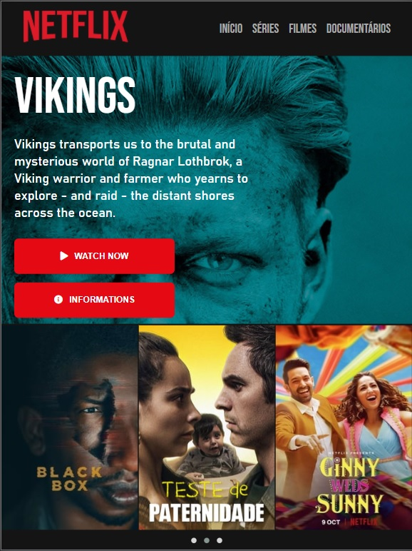

<h1 align="center">
    
</h1>

<h1 align="center">
    Netflix Clone
</h1>

<h1 align="center">
 
</h1>

## :book: About:

 A simple project with a responsive layoyt created during the React bootcamp at Digital Innovation One.

 ## :iphone: Tools:

 <ul>
  <li>HTML</li>
  <li>CSS</li>
  <li>JS</li>
 </ul>
 
## :computer: Running:

1 - Just download the project and open it using any IDE or go to https://bernardojachegou.github.io/netflix_javascript_DIO/
